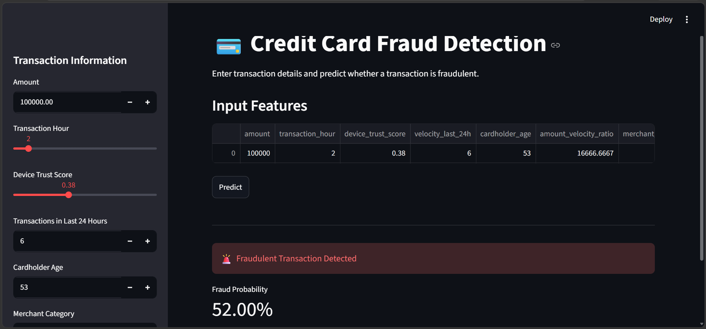
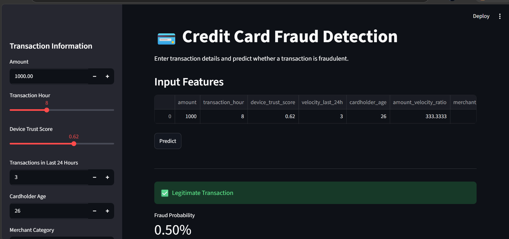
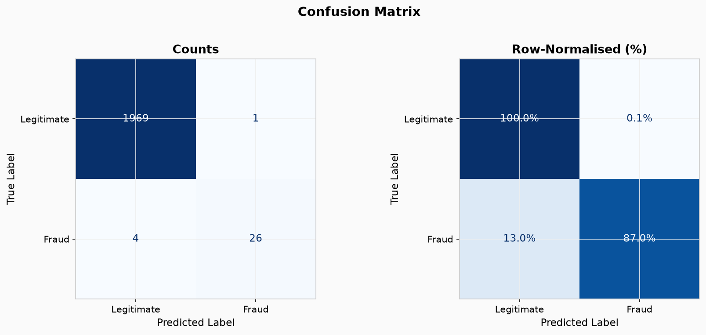
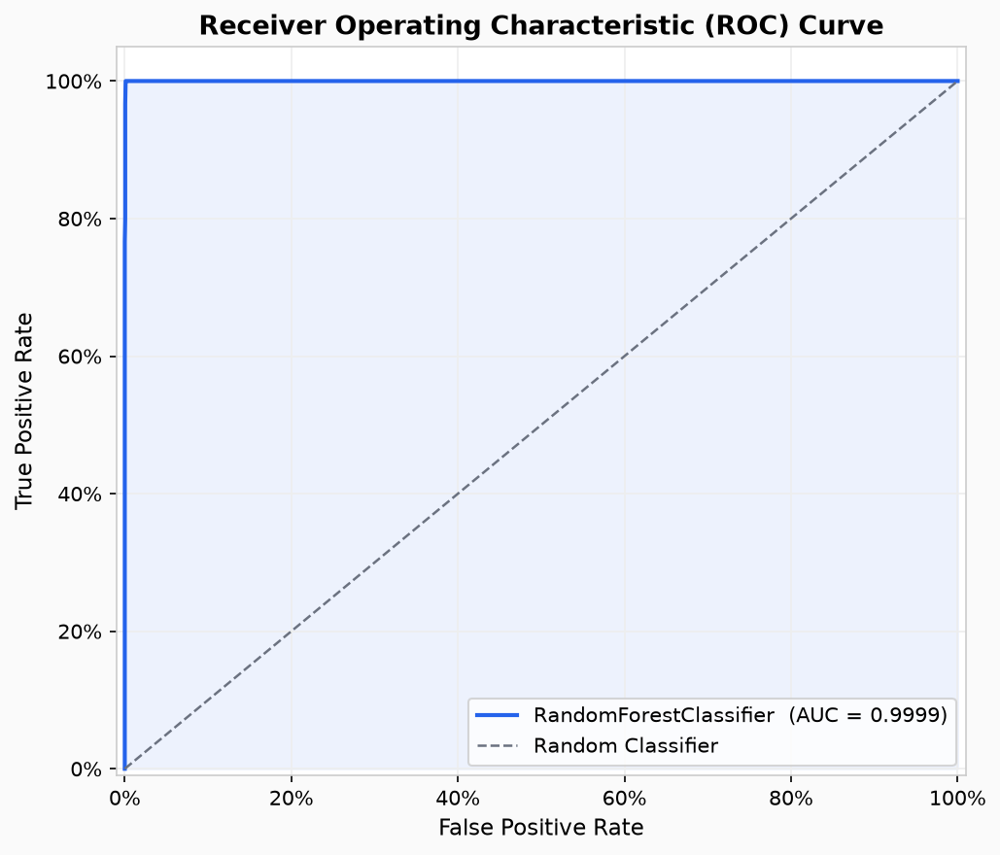
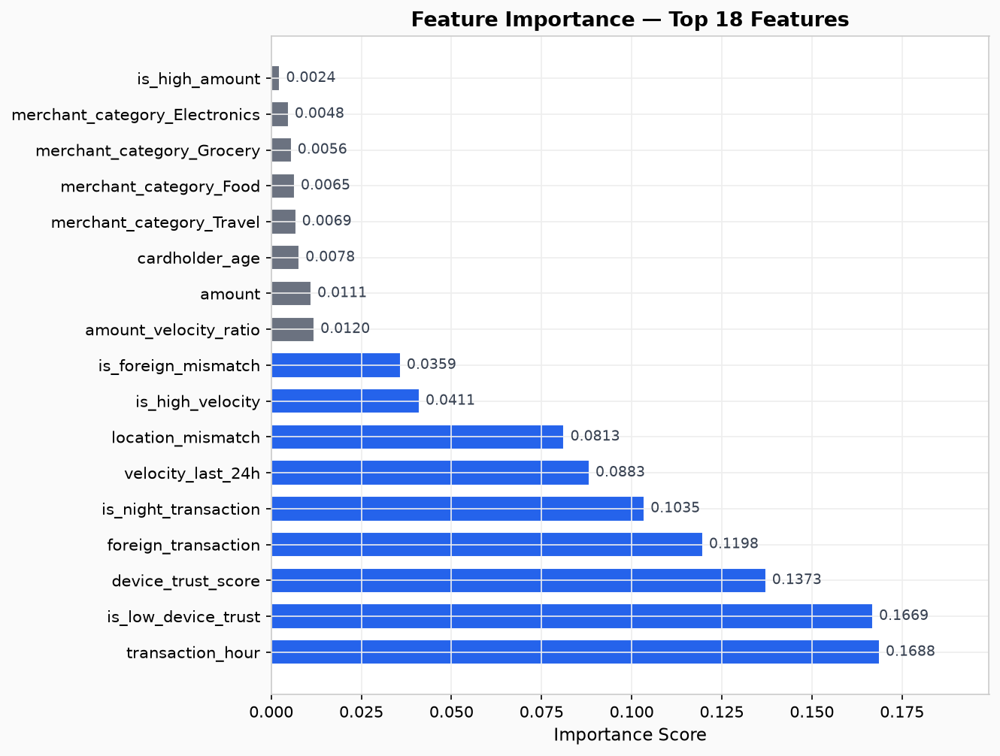

# 💳 Credit Card Fraud Detection System

An end-to-end Machine Learning project designed to identify fraudulent credit card transactions using behavioral analytics, risk-based features, and transaction patterns.

The system performs data preprocessing, feature engineering, model training, evaluation, hyperparameter tuning, and real-time fraud prediction through a Streamlit web application.

---

## 📌 Project Overview

Credit card fraud causes significant financial losses worldwide. This project aims to build a reliable fraud detection system capable of distinguishing legitimate transactions from fraudulent ones using supervised machine learning techniques.

Key objectives:

- Detect fraudulent transactions with high precision and recall
- Handle highly imbalanced datasets effectively
- Generate meaningful domain-driven features
- Evaluate multiple machine learning models
- Deploy the final model using Streamlit

---

## 🏗️ Project Architecture

```text
Raw Dataset
     │
     ▼
Data Preprocessing
     │
     ▼
Feature Engineering
     │
     ▼
Model Training
     │
     ▼
Model Evaluation
     │
     ▼
Hyperparameter Tuning
     │
     ▼
Saved Model (.pkl)
     │
     ▼
Streamlit Web Application
```

---

## 📂 Repository Structure

```text
FRAUD_DETECTION_PROJECT/
│
├── data/
│   ├── processed/
│   └── credit_card_fraud_10k.csv
│
├── logs/
│   ├── evaluate_model.log
│   ├── fix_leakage.log
│   ├── train_model.log
│   └── tune_model.log
│
├── models/
│   ├── best_model.pkl
│   ├── best_model_fixed.pkl
│   ├── tuned_model.pkl
│   ├── preprocessor.pkl
│   ├── fe_preprocessor.pkl
│   ├── fe_metadata.pkl
│   ├── training_metadata.json
│   ├── training_metadata_fixed.json
│   └── training_metadata.pkl
│
├── notebooks/
│   └── eda_analysis.ipynb
│
├── reports/
│   ├── eda_figures/
│   ├── figures/
│   │   ├── confusion_matrix.png
│   │   ├── roc_curve.png
│   │   ├── precision_recall_curve.png
│   │   └── feature_importance.png
│   ├── leakage_audit/
│   ├── leakage_fix/
│   ├── classification_report.txt
│   ├── evaluation_metrics.json
│   ├── model_comparison.csv
│   ├── tuning_results.csv
│   └── tuning_summary.json
│
├── src/
│   ├── __init__.py
│   ├── audit_leakage.py
│   ├── debug_leak_check.py
│   ├── evaluate_model.py
│   ├── feature_engineering.py
│   ├── fix_leakage.py
│   ├── predict.py
│   ├── preprocessing.py
│   ├── train_model.py
│   ├── tune_model.py
│   └── saved_model.txt
│
├── app.py
├── requirements.txt
├── README.md
└── venv/
```

---

## 🔧 Technologies Used

### Programming Language

- Python 3.13

### Data Analysis

- Pandas
- NumPy

### Machine Learning

- Scikit-Learn

### Visualization

- Matplotlib
- Seaborn

### Deployment

- Streamlit

### Model Persistence

- Pickle
- Joblib

---

## ⚙️ Feature Engineering

The following features were used to improve fraud detection performance:

| Feature | Description |
|----------|-------------|
| amount | Transaction amount |
| transaction_hour | Hour of transaction |
| device_trust_score | Device reliability score |
| velocity_last_24h | Number of recent transactions |
| cardholder_age | Customer age |
| amount_velocity_ratio | Amount compared to transaction velocity |
| foreign_transaction | Transaction occurred abroad |
| location_mismatch | User location differs from expected location |
| is_night_transaction | Transaction performed during night hours |
| is_high_amount | High-value transaction flag |
| is_high_velocity | Excessive transaction frequency flag |
| is_low_device_trust | Low device trust score flag |
| is_foreign_mismatch | Foreign transaction with location mismatch |
| merchant_category_* | One-hot encoded merchant categories |

---

## 🤖 Models Evaluated

The following machine learning models were trained and compared:

- Logistic Regression
- Decision Tree Classifier
- Random Forest Classifier

### Best Performing Model

**Random Forest Classifier**

Selected based on overall fraud detection performance and robustness on imbalanced data.

---

## 📊 Model Performance

### Test Dataset

- Total Transactions: 2,000
- Legitimate Transactions: 1,970
- Fraudulent Transactions: 30

### Overall Metrics

| Metric | Score |
|----------|----------|
| Accuracy | 99.75% |
| Precision | 99.74% |
| Recall | 99.75% |
| F1 Score | 99.74% |
| ROC-AUC | 99.99% |
| Average Precision | 99.06% |

### Fraud Class Performance

| Metric | Score |
|----------|----------|
| Precision | 96.30% |
| Recall | 86.67% |
| F1 Score | 91.23% |

The model successfully identifies fraudulent transactions while maintaining a very low false-positive rate.

---

## 📈 Evaluation Outputs

The evaluation pipeline automatically generates:

- Confusion Matrix
- ROC Curve
- Precision-Recall Curve
- Feature Importance Plot
- Classification Report
- Evaluation Metrics JSON

Generated files are stored in:

```text
reports/
├── figures/
├── classification_report.txt
└── evaluation_metrics.json
```

---

## 🛡️ Data Leakage Prevention

To ensure realistic model performance, a dedicated leakage detection and correction pipeline was implemented.

Key measures:

- Strict train-test separation
- Independent preprocessing on training data only
- Proper feature engineering workflow
- Leakage auditing scripts
- Validation of feature generation logic

Files involved:

```text
src/audit_leakage.py
src/fix_leakage.py
src/debug_leak_check.py
```

---

## 📸 Application Demo

### Fraud Prediction



### Legitimate Transaction Prediction



---

## 📊 Visual Results

### Confusion Matrix



### ROC Curve



### Feature Importance



---

## 🚀 Installation

### Clone Repository

```bash
git clone https://github.com/siva-1905/Fraud-detection-project.git

cd Fraud-detection-project
```

### Create Virtual Environment

```bash
python -m venv venv
```

### Activate Virtual Environment

Windows:

```bash
venv\Scripts\activate
```

Linux / macOS:

```bash
source venv/bin/activate
```

### Install Dependencies

```bash
pip install -r requirements.txt
```

---

## ▶️ Running the Project

### Data Preprocessing

```bash
python src/preprocessing.py
```

### Feature Engineering

```bash
python src/feature_engineering.py
```

### Model Training

```bash
python src/train_model.py
```

### Model Evaluation

```bash
python src/evaluate_model.py
```

### Hyperparameter Tuning

```bash
python src/tune_model.py
```

---

## 🌐 Running the Streamlit Application

```bash
streamlit run app.py
```

Open your browser and visit:

```text
http://localhost:8501
```

The application allows users to:

- Enter transaction details
- Generate fraud predictions
- View fraud probability scores
- Perform real-time transaction analysis

---

## 🔮 Future Improvements

- Implement XGBoost and LightGBM
- Add SHAP explainability visualizations
- Deploy using Docker
- Create REST APIs using FastAPI
- Add real-time streaming predictions
- Implement automated model retraining
- Add cloud deployment support (AWS/Azure)

---

## 👩‍💻 Author

### Siva Priya A

Bachelor of Engineering – Computer Science and Engineering

Areas of Interest:

- Artificial Intelligence
- Machine Learning
- Data Analytics
- Full Stack Development
- Software Engineering

GitHub:

https://github.com/siva-1905

---

## 📜 License

This project is licensed under the MIT License.

Feel free to use, modify, and distribute this project for educational and research purposes.